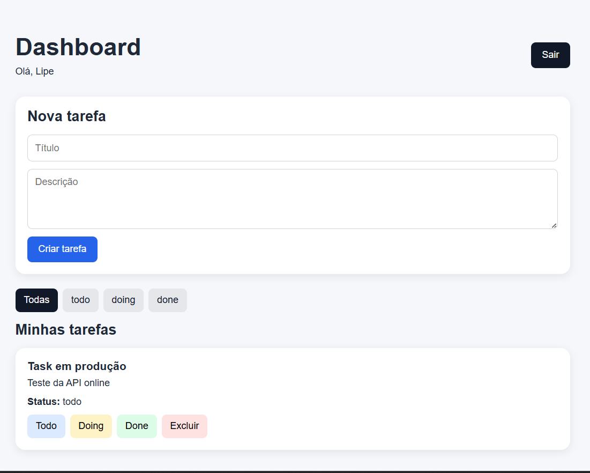

# 🚀 Task Manager API + Dashboard (Fullstack)

Sistema completo de gerenciamento de tarefas com autenticação JWT, arquitetura limpa e frontend integrado.

🔗 **Frontend (Vercel):** https://project3-sistema-de-gerenciamento-d-henna.vercel.app
🔗 **Backend (Render):** https://project3-sistema-de-gerenciamento-de-yvo8.onrender.com

---

## 📌 Sobre o projeto

Este projeto foi desenvolvido como parte do meu portfólio profissional com o objetivo de demonstrar habilidades em:

- Desenvolvimento **backend escalável**
- Arquitetura em camadas (Clean Architecture)
- Integração **fullstack (API + Frontend)**
- Autenticação segura com JWT
- Testes automatizados
- Deploy em ambiente real

---

## 🧠 Funcionalidades

### 🔐 Autenticação
- Cadastro de usuário
- Login com JWT
- Proteção de rotas
- Endpoint `/me` para usuário autenticado

### 📋 Tarefas
- Criar tarefa
- Listar tarefas
- Atualizar status (todo / doing / done)
- Deletar tarefa
- Associação por usuário

### 🔎 Filtros e busca
- Paginação
- Filtro por status
- Busca por título/descrição

### 🧪 Testes
- Testes de integração com Vitest + Supertest
- Cobertura das principais rotas

---

## 🖥️ Tecnologias

### Backend
- Node.js
- TypeScript
- Express
- Prisma ORM
- PostgreSQL (Neon)
- JWT
- Zod
- Vitest + Supertest

### Frontend
- React
- Vite
- TypeScript
- Axios
- React Router
- React Hot Toast

### Infra / Deploy
- Render (API)
- Neon (Banco de dados)
- Vercel (Frontend)

---

## 🏗️ Arquitetura

O projeto segue uma estrutura baseada em **Clean Architecture**, separando responsabilidades:
```
src/
application/ # Casos de uso
domain/ # Regras de negócio
infrastructure/ # Banco, providers
interfaces/ # Controllers, rotas, middlewares
main/ # Configuração da aplicação

```

---

## 🔗 Rotas da API

### Auth
- `POST /auth/register`
- `POST /auth/login`

### Usuário autenticado
- `GET /me`

### Tasks
- `POST /tasks`
- `GET /tasks`
- `PATCH /tasks/:id`
- `DELETE /tasks/:id`

---

## 📦 Exemplos de uso

### 🔐 Login

```
http
POST /auth/login
Content-Type: application/json

{
  "email": "lipe@email.com",
  "password": "123456"
}

```

## 📋 Criar tarefa

```
POST /tasks
Authorization: Bearer TOKEN

{
  "title": "Estudar testes",
  "description": "Implementar Vitest"
}
```
## 🔎 Paginação e filtros

GET /tasks?page=1&limit=10
GET /tasks?status=todo
GET /tasks?search=jwt

## ⚙️ Variáveis de ambiente

DATABASE_URL="postgresql://..."
JWT_SECRET="sua_chave_secreta"
JWT_EXPIRES_IN="1h"
BCRYPT_SALT_ROUNDS="10"
PORT="3333"
CORS_ORIGIN="http://localhost:5173"

## ▶️ Como rodar localmente

```
# instalar dependências
npm install

# rodar migrations
npx prisma migrate dev

# Iniciar servidor
npm run dev

```
**API disponível em:**

http://localhost:3333

## 🧪 Testes

*npm test*

✔️ 5 arquivos de teste
✔️ 9 testes passando

## 📸 Preview

